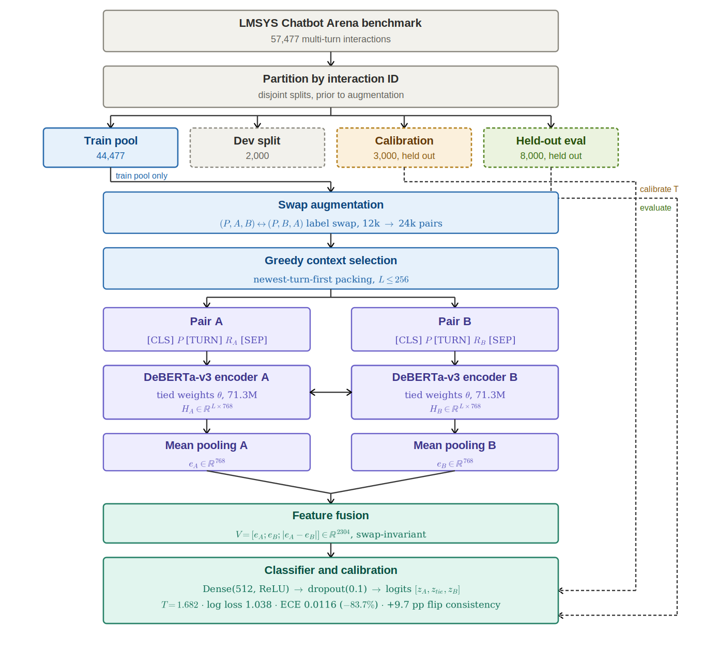

# Efficient LLM Preference Classification Through Position Bias Mitigation and Architectural Symmetry

[](https://www.python.org/)
[](https://keras.io/)
[](LICENSE)
[](https://link.springer.com/journal/10489)

Official reproducibility repository for the manuscript:
> **"Efficient LLM Preference Classification Through Position Bias Mitigation and Architectural Symmetry"**  
> *Applied Intelligence* (Springer Nature), Manuscript ID: `APIN-D-26-05359`.

---

## Architecture Overview



This repository provides the end-to-end experimental pipeline, data partitioning protocols, training scripts, and per-run prediction outputs to reproduce every table, metric, and statistical significance test reported in the paper.

---

## Key Highlights & Findings

- **Leakage-Free Partitioning:** 57,477 multi-turn LMSYS Chatbot Arena interactions partitioned strictly by `id` prior to augmentation into disjoint subsets: Train pool (44,477), Dev (2,000), Calibration (3,000), and Evaluation (8,000). Split disjointness is verified at runtime.
- **Position Bias Invariance:** Training-time swap augmentation elevates position-flip consistency from **0.824** to **0.920**. A duplicate-augmentation volume control achieves only **0.811**, proving the gain stems from positional symmetry rather than data volume.
- **Super-Additive Synergy:** Neither swap augmentation nor Siamese difference fusion alone improves log loss; only their combination achieves significant log-loss reduction, yielding an interaction of **$-0.0061$ (95% CI $[-0.0081, -0.0041]$)** across three random seeds.
- **Strict Calibration Separation:** Post-hoc temperature calibration ($T = 1.682$) is fitted exclusively on the 3,000-sample calibration split and evaluated on the 8,000-sample test set, preventing leakage.
- **Cross-Dataset Transfer:** Zero-shot evaluation on MT-Bench Human Judgments achieves **51.84%** accuracy against a 38.54% majority floor without dataset-specific fine-tuning.

---

## Repository Structure

```
.
├── README.md                      # Documentation & reproduction guide
├── LICENSE                        # MIT License
├── requirements.txt               # Python dependencies
├── lmsys_revision_v2.ipynb        # Primary reproduction notebook (Kaggle / Colab ready)
├── notebook_src.py                # Plain-Python pipeline source code (Jupytext format)
├── build_nb.py                    # Script to convert notebook_src.py into .ipynb
├── test_local.py                  # Local CPU test suite verifying splits and metrics
├── assets/
│   └── pipeline_diagram.png       # Publication architecture diagram (Figure 1)
└── results/
    ├── paper_results.json         # Raw per-run predictions, metrics, and CI across all seeds
    └── final_tables.tex           # Formatted LaTeX tables generated directly from results
```

---

## Getting Started

### 1. Installation

```bash
git clone https://github.com/Vatsal057/llm-preference-classification.git
cd llm-preference-classification
python3 -m venv venv
source venv/bin/activate
pip install -r requirements.txt
```

### 2. Verify Logic Locally (CPU / No GPU Needed)

You can run the full suite of unit tests validating data partitioning, swap augmentation invariants, context selection, and statistical calibration formulas:

```bash
python3 test_local.py
```

### 3. Running Full Experiments (Kaggle / GPU)

The primary experiment runner is provided as [`lmsys_revision_v2.ipynb`](lmsys_revision_v2.ipynb):

1. **Upload:** Import `lmsys_revision_v2.ipynb` into [Kaggle Notebooks](https://www.kaggle.com/code).
2. **Attach Data:** Add dataset `lmsys/chatbot-arena-human-preference` (or `kaggle competitions download -c llm-classification-finetuning`).
3. **Hardware:** Select GPU accelerator (**NVIDIA T4 x2** or P100) with Internet enabled.
4. **Smoke Test Mode:** Leave `CFG.SMOKE_TEST = True` (Section 2) for an end-to-end 10-minute dry run across all backbones and splits.
5. **Full Reproduction:** Set `CFG.SMOKE_TEST = False` and select *Save & Run All*.

---

## Experimental Environment

As documented in Section 4.1 of the paper:
- **Operating System:** Linux / Ubuntu (CUDA 12.8, Driver 580.159.04)
- **Hardware:** 2x NVIDIA Tesla T4 (16GB VRAM each)
- **Software Stack:**
  - Python 3.12.13
  - Keras 3.13.2 (JAX backend)
  - keras-hub 0.26.0
  - JAX & jaxlib 0.7.2
  - TensorFlow 2.20.0
  - scikit-learn 1.6.1, SciPy 1.16.3, NumPy 2.0.2

---

## Regenerating Paper Tables Without Retraining

All per-run predictions, bootstrap confidence intervals, and metrics across all random seeds (42, 1337, 2024) are pre-computed and stored in [`results/paper_results.json`](results/paper_results.json).

You can inspect or regenerate the LaTeX tables in [`results/final_tables.tex`](results/final_tables.tex) without needing GPU retraining.

---

## Citation

```bibtex
@article{vaghasiya2026efficient,
  title={Efficient LLM Preference Classification Through Position Bias Mitigation and Architectural Symmetry},
  author={Vaghasiya, Vatsal and Kshetrimayum, Nancy and Prabadevi, B. and Prathap, Boppuru Rudra},
  journal={Applied Intelligence},
  year={2026},
  note={Manuscript APIN-D-26-05359}
}
```

---

## License

This project is licensed under the MIT License - see the [LICENSE](LICENSE) file for details.
